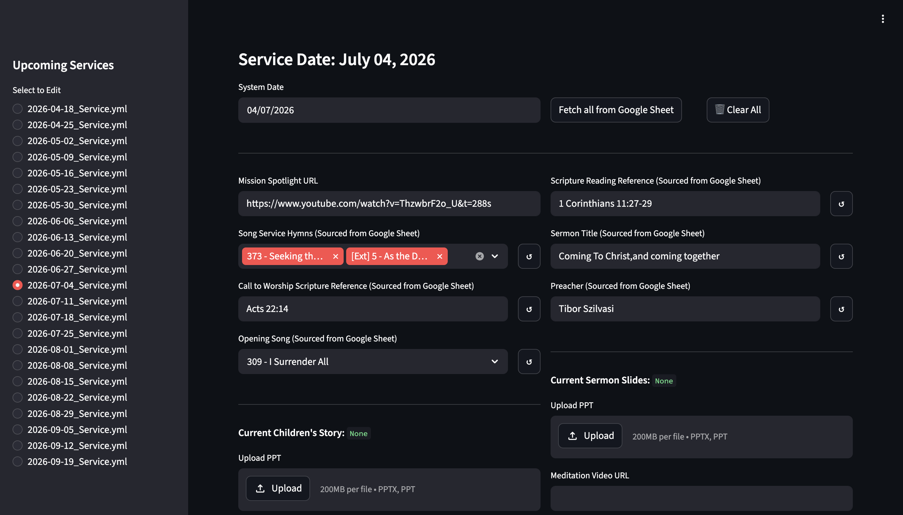

# ISDA PPT Generator



Automatic generation of PowerPoint presentations from templates for worship services at the [International Seventh-Day Adventist Church of Brussels](https://isdachurch.be).

Builds slide decks from YAML config files using a `python-pptx` template, with support for hymns, sermons, announcements, video clips, and Google Sheets integration for schedule data.

## Setup

This project uses `uv` for dependency management:

```bash
uv sync
```

Python 3.13+ required.

## Usage

The CLI is installed as `isda-pptgen`. Run via `uv`:

```bash
uv run isda-pptgen --help
```

### Commands

#### `build-ws` — Build worship service slides

```bash
uv run isda-pptgen build-ws --config configs/2026-04-18_Service.yml
```

Reads a YAML service config and generates a `.pptx` with hymns, videos, images, sermon titles, and announcements.

#### `generate-lyrics` — Generate hymn lyric slides

```bash
uv run isda-pptgen generate-lyrics [--force]
```

Pre-renders individual hymn presentations (used as building blocks by `build-ws`). The `--force` flag regenerates all hymns even if they already exist.

#### `webui` — Worship Builder (Streamlit)

```bash
uv run isda-pptgen webui
```

Interactive web interface to create, edit, preview, and build service configs visually.

#### `songs-manager` — Song database editor (Streamlit)

```bash
uv run isda-pptgen songs-manager
```

Manage the hymn and external song databases (add, edit, delete entries).

#### `create` — Create a config for the upcoming Saturday

```bash
uv run isda-pptgen create
uv run isda-pptgen create --populate   # auto-populate from Google Sheets
```

Generates an empty YAML service file for the next Saturday, optionally pre-filled from the church's Google Sheet schedule.

#### `populate` — Populate empty fields in an existing config

```bash
uv run isda-pptgen populate configs/2026-09-05_Service.yml
```

Fills in missing values (hymns, speakers, etc.) from the Google Sheet schedule.

#### `images-to-slides` — Turn image files into a presentation

```bash
uv run isda-pptgen images-to-slides -d ./photos --caption "My Caption"
```

Options:
- `-o` / `--output` — Output filename (default: `images_presentation.pptx`)
- `-c` / `--caption` — Caption to add to each slide
- `--extensions` — Comma-separated image extensions (default: `jpg,jpeg,png,gif,bmp,webp`)
- `-d` / `--directory` — Directory to scan (default: current directory)

## Project Structure

```
isda-pptgen/
├── src/isda_pptgen/
│   ├── main.py                 # CLI entry point
│   ├── build_ws.py             # Worship service builder orchestration
│   ├── builder.py              # Core slide creation (text, images, video, charts)
│   ├── config_manager.py       # Config creation and Google Sheets population
│   ├── duplicate.py            # Slide duplication utilities (shapes, charts, tables)
│   ├── fetch_schedule.py       # Google Sheets API client (gspread)
│   ├── hymn_lyrics_generator.py # Pre-render hymn slides to disk
│   ├── images_to_slides.py     # Generate .pptx from image files
│   ├── merge.py                # PPTX merge with source formatting preservation
│   ├── songs_ui.py             # Streamlit song database editor
│   ├── webui.py                # Streamlit worship builder UI
│   ├── ytdl.py                 # YouTube downloader (yt-dlp wrapper)
│   ├── build_ws.yml            # Default service config
│   └── build_ws.template.yml   # YAML config template
├── assets/
│   ├── template.pptx           # PowerPoint template
│   ├── hymns.json              # Hymn database
│   └── external_songs.json     # External song database
├── configs/                    # Service YAML configs (gitignored)
├── output/                     # Generated presentations (gitignored)
├── media/                      # Downloaded/downloadable media (gitignored)
├── cache/                      # Cached data (gitignored)
├── hymns/                      # Pre-rendered hymn slides (gitignored)
├── external_songs/             # Pre-rendered external song slides (gitignored)
├── tests/
│   ├── test_main.py            # CLI help smoke test
│   └── test_hymns_integrity.py # Data integrity checks for hymns
└── pyproject.toml
```

## Quality Control

```bash
uv run pytest
```

The hymn integrity tests verify that lyrics fit within slides, there is no trailing whitespace, and all data references are valid.

## Data

Hymn and song data lives in `assets/hymns.json` and `assets/external_songs.json` — a JSON collection of hymns/songs with lyrics structured as verses and refrains. The schema:

```json
{
  "id": 1,
  "name": "Praise to the Lord",
  "author": null,
  "key": null,
  "lyrics": [
    { "type": "verse", "number": 1, "text": "..." },
    { "type": "refrain", "text": "…", "position": 1 }
  ]
}
```

- **Verse**: has `number` (verse order) and `text`. Blank lines within `text` indicate suggested slide splits for long verses.
- **Refrain**: has `position` — `0` (before first verse and after every verse), `1` (after every verse), or `2` (alternative after last verse).
- `author` and `key` may be `null` where unknown.